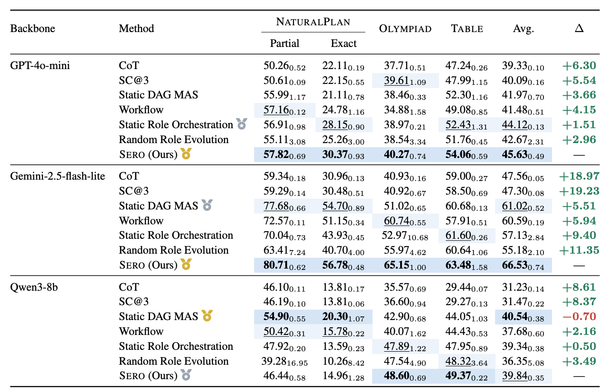

# SERO: Self-Evolving Role Orchestration

<p align="center">
  <strong>Roles with Rails: Contract-Preserving Role Evolution in Multi-Agent Structured Reasoning</strong>
</p>

SERO is a framework for **contract-preserving role evolution** in LLM multi-agent systems. It evolves a typed role-card pool through credit-guided retrieval, a credit-ranked communication DAG with a protected terminal aggregator and conditional validator repair, and a contextual-bandit controller whose LLM-proposed edits are committed only when they preserve five structural contracts and improve task score.

<div align="center">

| [📄 Paper]() | [🌐 Project Page]() | [📊 Main Results](#results) |

</div>

---

## Overview

Role-based LLM multi-agent systems need **adaptive role pools**, yet roles are not interchangeable prompts — they carry **structural obligations**: capability coverage, message compatibility, validation, final-answer aggregation, and parser-compatible output protocols. Existing systems either *fix* the role inventory and lose adaptivity, or allow *unconstrained generation* to induce role drift, removing structurally necessary roles and breaking answer contracts.

SERO formulates this as **contract-preserving role evolution**: every committed edit must preserve five structural contracts.

| Contract | Guarantee |
|----------|-----------|
| **Capability** | At least one role remains per required capability family |
| **Communication** | The active team forms a DAG consistent with each role's protocol |
| **Validation** | Error-detection / repair capacity stays reachable |
| **Aggregation** | A protected terminal role owns the final decision |
| **Output protocol** | The final response stays compatible with the benchmark parser |

SERO realizes this as guarded editing: a contextual-bandit controller **proposes** edits freely, while a contract checker defines which proposals are admissible and a score gate decides which become persistent.

---

## Installation

```bash
git clone https://github.com/your-org/sero.git
cd sero
pip install -e .
```

or install dependencies only:

```bash
pip install -r requirements.txt
```

**Requirements:** Python ≥ 3.9, PyTorch ≥ 2.0, `sentence-transformers` ≥ 2.2, `openai` ≥ 1.0.

A conda environment file is also provided (`environment-sero.yml`).

### API Key

SERO uses an OpenAI-compatible API. Set your key via environment variable:

```bash
export OPENROUTER_API_KEY="your-key"      # required
export OPENROUTER_BASE_URL="https://..."  # optional; defaults to OpenRouter
export SERO_AGENT_MODEL="gpt-4o-mini"     # optional model override
export SERO_EXECUTOR_MODEL="gpt-4o-mini"  # optional role-editor model override
```

> ⚠️ No API key is hard-coded in this repository. You must provide `OPENROUTER_API_KEY` yourself.

---

## Data Setup

Download the three benchmark suites into `Benchmark/`:

```bash
# NaturalPlan (trip / meeting / calendar)
git clone https://github.com/google-deepmind/natural-plan.git Benchmark/natural-plan

# OlympiadBench
git clone https://github.com/OpenBMB/OlympiadBench.git Benchmark/OlympiadBench

# TableBench — download TableBench.jsonl into Benchmark/TableBench-main/
```

The canonical train/eval split (`Benchmark/train_split.json`) is **bundled**, so results are reproducible without re-generating splits. It provides fixed train keys (stratified by difficulty tier, seed 42) and the corresponding held-out keys per benchmark.

---

## Reproducing the Main Results

The main results table (three LLM backbones × seven methods over NaturalPlan, OlympiadBench, and TableBench) is reproduced by training and evaluating SERO with the hyperparameters listed in the paper's appendix.

### 1. Train + evaluate SERO (single seed)

```bash
export OPENROUTER_API_KEY="your-key"
export SERO_AGENT_MODEL="gpt-4o-mini"   # or the backbone you want

# One-shot: train then evaluate on the held-out split
bash scripts/full_sero_run.sh naturalplan 42
```

This produces the **SERO (Ours)** row. `scripts/full_sero_run.sh` encodes the full set of training/eval hyperparameters (specialist slots, credit EMA momentum, collaboration rounds, etc.); override them via environment variables as documented in the script header.

### 2. Ablation runs

```bash
python scripts/ablation.py --benchmark naturalplan --seed 42
```

### 3. Multi-seed robustness

```bash
python scripts/multiseed.py --benchmark naturalplan --seeds 42 123 456
```

All scripts write results to `results/` (created automatically).

> **Note on baselines.** The comparison baselines (CoT, SC, static pool, static DAG, workflow, random evolution) in the main table are implemented in `sero/baselines/` and dispatched through `scripts/evaluate.py --system <name>`. They are kept in this repository for completeness but are not required to reproduce the SERO row.

---

## Benchmarks

| `--benchmark` | Task family | Metric |
|---------------|-------------|--------|
| `naturalplan` | Mixed NaturalPlan (trip + calendar + meeting) | Partial & exact task accuracy |
| `trip` | Trip planning | Constraint satisfaction rate |
| `calendar` | Calendar scheduling | Exact-match solve rate |
| `meeting` | Meeting scheduling | Valid-meeting match |
| `olympiadbench` | Competition math & physics (text-only EN subset) | Official judge + string fallback |
| `tablebench` | Table QA (non-visual subset) | Normalized single-line accuracy |

---

## Repository Layout

```
sero/
├── config.py              All hyperparameters and API settings
├── role_card.py           Typed RoleCard schema + seed pools for all benchmarks
├── credit_engine.py       Fast / leave-one-out / EMA credit estimation
├── controller.py          Factorized REINFORCE policy (~677K params)
├── dag_builder.py         Credit-ranked communication DAG construction
├── phase_a.py             Inference: retrieval → DAG → message passing → aggregation
├── trainer.py             Guarded evolution loop (propose → check → commit/rollback)
├── executor.py            Role-card editor (ADD / REMOVE / NOOP) with format inheritance
├── openrouter_client.py   OpenAI-compatible API wrapper (timeout-safe)
├── benchmarks/            Task adapters + scoring utilities
└── baselines/             CoT, SC, static pool, static DAG, workflow, random evolution
scripts/                   Entry points: train / evaluate / ablation / multiseed / full run
Benchmark/                 Bundled train_split.json (datasets downloaded separately)
assets/                    Main-results table figure
```

---

## Results

The table below is the paper's **Table 2 (Main results)**, averaging over three seeds.

<p align="center">
  
</p>

SERO is the top method on every metric for GPT-4o-mini and Gemini-2.5-flash-lite, and remains best on OlympiadBench and TableBench under Qwen3-8b.

---

## Citation

```bibtex
@inproceedings{ge2026sero,
  title={Roles with Rails: Contract-Preserving Role Evolution in Multi-Agent Structured Reasoning},
  author={Ge, Ling-Yue and Guo, Lan-Zhe},
  booktitle={Proceedings of the 2026 Conference on Empirical Methods in Natural Language Processing},
  year={2026}
}
```

---

## License

This project is released under the [MIT License](LICENSE).
